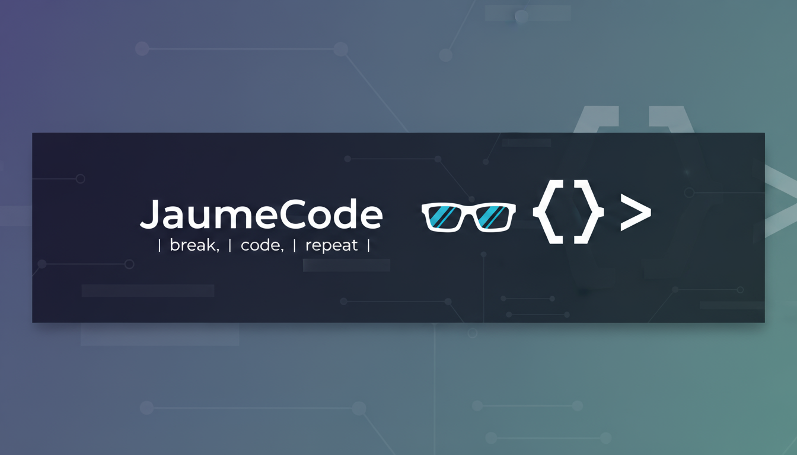

# 👋 ¡Hola! Soy Jaume Vanacloig ,conocido por JaumeCode

💻 Estudiante de **Desarrollo de Aplicaciones Web (DAW)**  
🔧 Grado medio en **Sistemas Microinformáticos y Redes**  
🚀 Apasionado por la **programación, la inteligencia artificial y la tecnología**

---

### 🧠 Tecnologías que uso
- HTML, CSS, JavaScript  
- Python, SQL 
- Git, Figma
- Aprendiendo Herramientas de diseño y Frameworks

---

### 📂 Proyectos destacados
- 🌤️ *Aplicacion del tiempo interactiva*  
- 🎰 *Casino en python*  
- 🏧*App de cajero*

---

### 📫 Cómo contactarme
- 💼 Portfolio  
- 📧 vanacloigjaume@gmail.com

---

⭐ *“Cada línea de código es una oportunidad para aprender algo nuevo.”*
